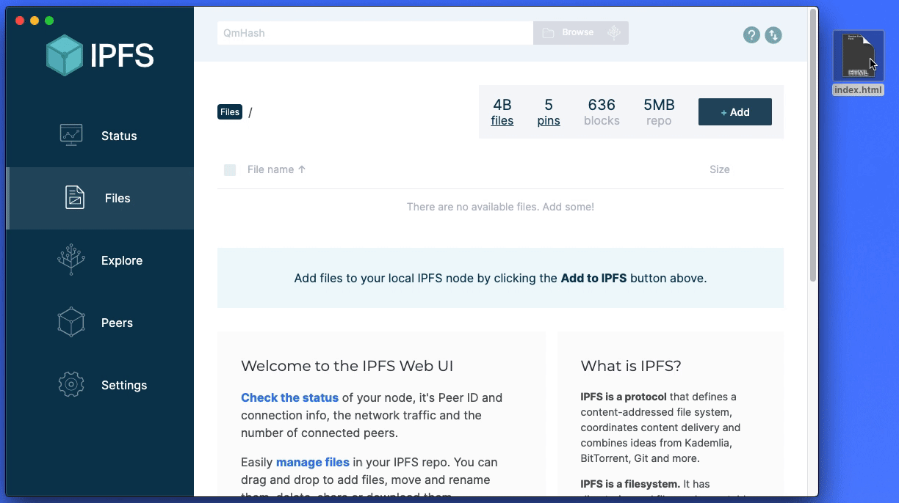
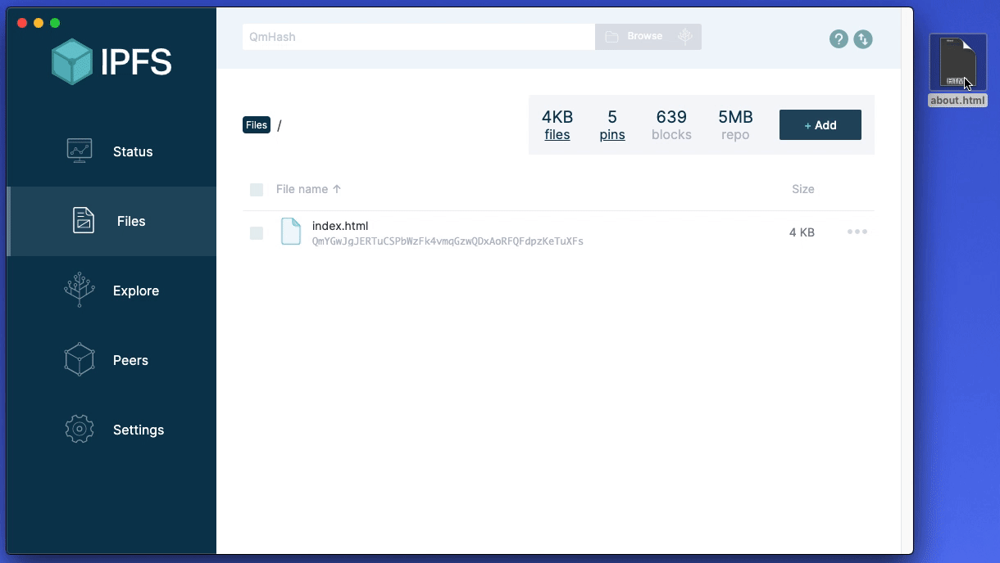
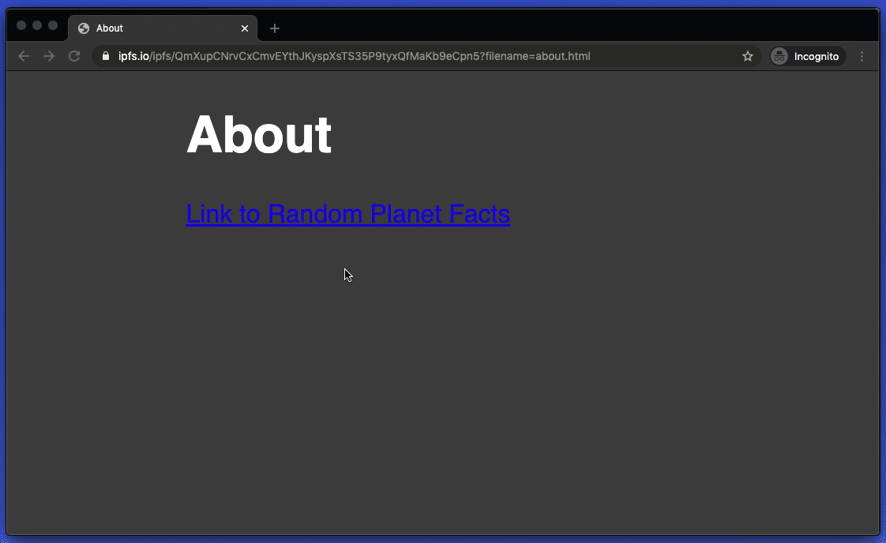
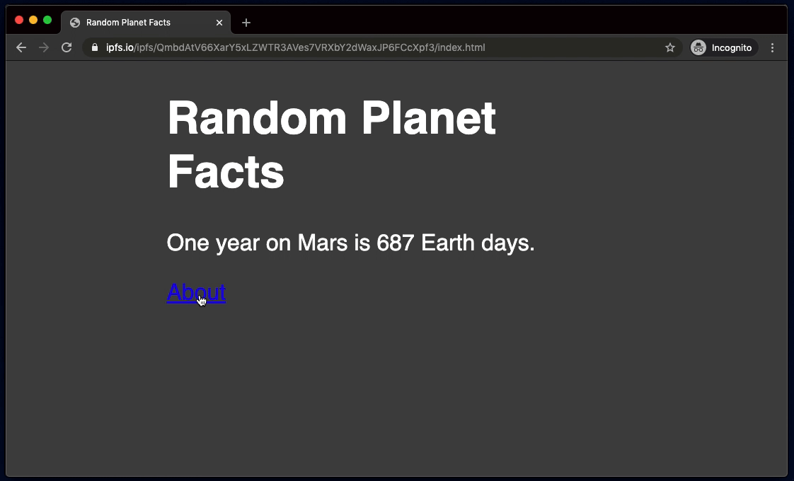

# Multipage website

In this guide you will learn how to host a website with multiple pages and external assets on IPFS. This is a follow on from the [single page website guide](single-page-website). You don't have to have completed that guide to understand what's going on here, but it will give you a solid foundation to work off.

There are a few ways of creating multiple pages.

- Individually upload files and link through CID.
- [Upload a directory with relative paths.](upload-a-directory-with-relative-paths)

## Indivudally upload files

1. Create a file called `index.html` and paste the following code. We'll continue using the code from the [single page website](how-to/websites-on-ipfs/single-page-website/#add-your-site).

2. Open IPFS desktop and upload `index.html`



3. Copy the link. We'll use this to link for the `about` page.

4. Create a file called `about.html` and paste in the following code.

```html
<!DOCTYPE html>
<html lang="en">
  <head>
    <meta charset="utf-8" />
    <title>About</title>
    <meta
      name="description"
      content="Get a random fact about a planet in our solar system."
    />
    <meta name="author" content="The IPFS Docs team." />
    <style>
      body {
        margin: 15px auto;
        max-width: 650px;
        line-height: 1.2;
        font-family: sans-serif;
        font-size: 2em;
        color: #fff;
        background: #444;
      }
    </style>
  </head>
  <body>
    <h1>About</h1>
    <!-- Use the link from step 3 -->
    <a href="https://ipfs.io/ipfs/$SITE_CID"> Link to Random Planet Facts </a>
  </body>
</html>
```

Notice how the `href` is an absolute path.

5. Open IPFS desktop and upload `about.html`



6. Once uploaded, verify that the link works.



## Upload a directory with relative paths

Instead of individually uploading each file, you can upload a whole directory. This method is more practical for larger projects.

1. Create a directory called `Random Planet Facts`

2. Inside the directory, create the file structure

```
Random Planet Facts
├── about.html
├── images
│   └── logo.png
└── index.html
```

Create a file called `index.html` and paste in the following code.

```html
<!DOCTYPE html>
<html lang="en">
  <head>
    <meta charset="utf-8" />
    <title>Random Planet Facts</title>
    <style>
      body {
        margin: 15px auto;
        max-width: 650px;
        line-height: 1.2;
        font-family: sans-serif;
        font-size: 2em;
        color: #fff;
        background: #444;
      }
    </style>
  </head>
  <body>
    <h1>Random Planet Facts</h1>
    <p>One year on Mars is 687 Earth days.</p>
    <a href="about.html"> About </a>
  </body>
</html>
```

Create a file called `about.html` and paste in the following code.

```html
<!DOCTYPE html>
<html lang="en">
  <head>
    <meta charset="utf-8" />
    <title>About</title>
    <style>
      body {
        margin: 15px auto;
        max-width: 650px;
        line-height: 1.2;
        font-family: sans-serif;
        font-size: 2em;
        color: #fff;
        background: #444;
      }
    </style>
  </head>
  <body>
    <h1>About</h1>
    <a href="index.html"> Link to Random Planet Facts </a>
    
  </body>
</html>
```

Use any image for `logo.png`.

Notice how the `href` and `src` use relative paths instead of a CID.

5. Open IPFS desktop and upload the directory `Random Planet Facts`.


6. Use the link to verify.


